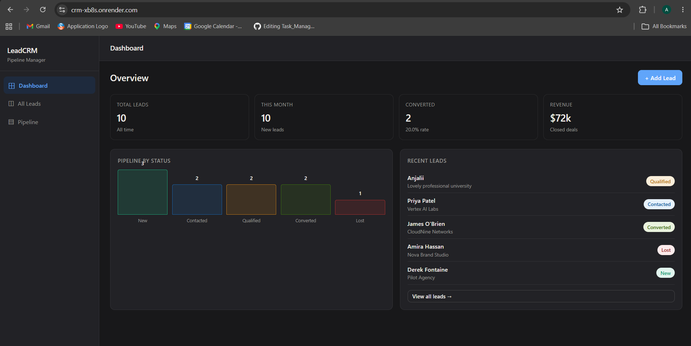
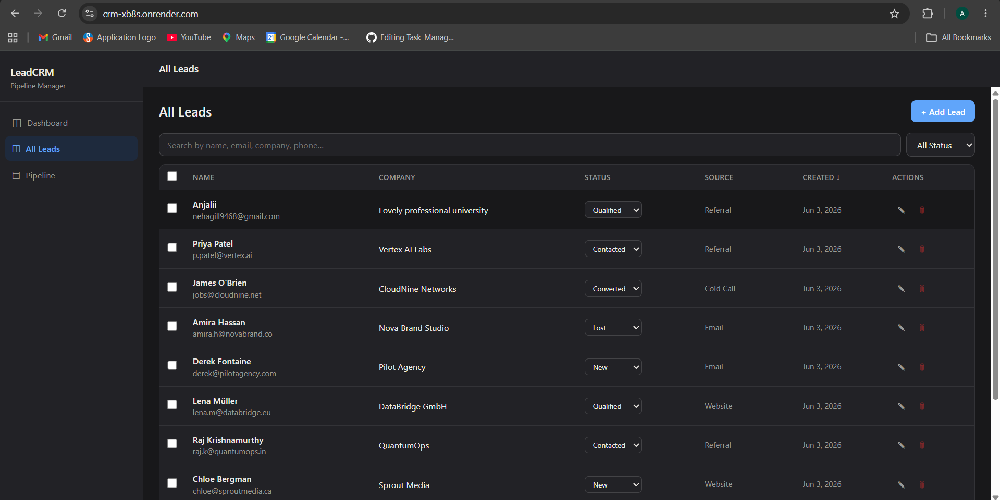
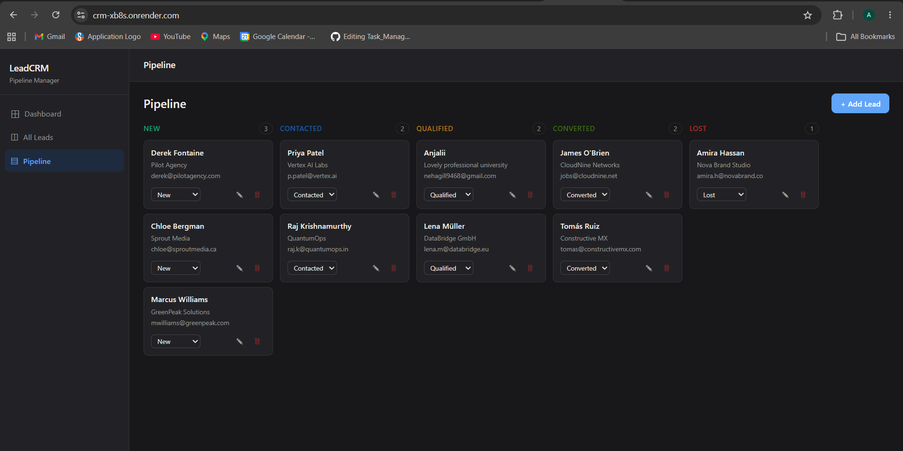

# LeadCRM — Full-Stack Lead Management System

A production-ready CRM application for managing leads/customers through a sales pipeline. Built with React, Node.js/Express, and MongoDB.

## Live Demo

> [https://crm-xb8s.onrender.com/]

## Features

### Core
- **Add / Edit / Delete leads** — Full CRUD with validation
- **Lead dashboard** — Pipeline stats, bar charts, recent activity
- **Kanban pipeline view** — Drag-free status board with inline updates
- **Table view** with sorting, pagination, and bulk delete
- **Search** — Real-time across name, email, company, phone
- **Status filter** — Funnel-style quick filter bar
- **Quick status update** — Inline dropdown without opening modal

### Bonus
- Lead statistics dashboard with conversion rate and revenue tracking
- Pagination (10 per page) with page controls
- Multi-column sorting (name, company, source, createdAt)
- Bulk selection and bulk delete
- Source tracking (Website, Referral, Social Media, Email, Cold Call)
- Deal value tracking per lead
- Responsive design — works on mobile
- Status funnel visualization

## Tech Stack

| Layer | Technology |
|-------|-----------|
| Frontend | React 18, Context API, Axios |
| Backend | Node.js 18, Express.js 4 |
| Database | MongoDB with Mongoose ODM |
| Validation | express-validator |
| Notifications | react-hot-toast |

## Project Structure

```
crm/
├── backend/
│   ├── config/
│   │   └── db.js              # MongoDB connection
│   ├── models/
│   │   └── Lead.js            # Mongoose schema
│   ├── routes/
│   │   └── leads.js           # All API routes
│   ├── .env.example
│   ├── package.json
│   └── server.js              # Express app entry point
│
└── frontend/
    ├── src/
    │   ├── components/
    │   │   ├── Sidebar.js
    │   │   ├── Topbar.js
    │   │   └── LeadModal.js   # Add/Edit modal
    │   ├── context/
    │   │   └── LeadsContext.js # Global state + API calls
    │   ├── pages/
    │   │   ├── Dashboard.js
    │   │   ├── Leads.js       # Table view
    │   │   └── Pipeline.js    # Kanban view
    │   ├── utils/
    │   │   └── api.js         # Axios instance + API methods
    │   ├── App.js
    │   └── App.css
    └── package.json
```

## API Reference

### Leads

| Method | Endpoint | Description |
|--------|----------|-------------|
| `GET` | `/api/leads` | Get all leads (with filters, pagination, sort) |
| `GET` | `/api/leads/stats` | Dashboard statistics |
| `GET` | `/api/leads/:id` | Get single lead |
| `POST` | `/api/leads` | Create lead |
| `PUT` | `/api/leads/:id` | Full update lead |
| `PATCH` | `/api/leads/:id/status` | Update status only |
| `DELETE` | `/api/leads/:id` | Delete lead |
| `DELETE` | `/api/leads` | Bulk delete (body: `{ ids: [...] }`) |

### Query Parameters (`GET /api/leads`)

| Param | Type | Default | Description |
|-------|------|---------|-------------|
| `search` | string | — | Search name/email/company/phone |
| `status` | string | All | Filter by status |
| `source` | string | All | Filter by source |
| `sortBy` | string | createdAt | Sort field |
| `sortOrder` | asc\|desc | desc | Sort direction |
| `page` | number | 1 | Page number |
| `limit` | number | 10 | Results per page |

### Lead Schema

```json
{
  "name": "Jane Smith",
  "email": "jane@company.com",
  "phone": "+1-555-0100",
  "company": "Acme Corp",
  "status": "New | Contacted | Qualified | Converted | Lost",
  "source": "Website | Referral | Social Media | Email | Cold Call | Other",
  "value": 10000,
  "notes": "Optional notes about this lead",
  "createdAt": "2024-01-15T10:30:00.000Z"
}
```

## Setup Instructions

### Prerequisites
- Node.js 18+
- MongoDB (local or MongoDB Atlas)
- npm or yarn

### 1. Clone the repository

```bash
git clone https://github.com/Anugill05/CRM
cd CRM
```

### 2. Backend setup

```bash
cd backend
npm install
cp .env.example .env
```

Edit `.env`:
```env
PORT=5000
MONGODB_URI=mongodb://localhost:27017/crm_db
# For MongoDB Atlas:
# MONGODB_URI=mongodb+srv://<user>:<pass>@cluster.mongodb.net/crm_db
NODE_ENV=development
```

Start the backend:
```bash
npm run dev    # Development with nodemon
# or
npm start      # Production
```

The API will be available at `http://localhost:5000`

### 3. Frontend setup

```bash
cd frontend
npm install
```

Create `.env`:
```env
REACT_APP_API_URL=http://localhost:5000/api
```

Start the frontend:
```bash
npm start
```

The app will open at `http://localhost:3000`

### 4. Seed sample data (optional)

```bash
cd backend
node scripts/seed.js
```

## Deployment

### Backend — Railway / Render / Heroku

1. Set environment variables:
   - `MONGODB_URI` → your MongoDB Atlas connection string
   - `PORT` → 5000 (or let the platform assign it)
   - `NODE_ENV` → production

2. Deploy from `/backend` directory.

### Frontend — Vercel / Netlify

1. Set environment variable:
   - `REACT_APP_API_URL` → your deployed backend URL (e.g., `https://your-api.railway.app/api`)

2. Build command: `npm run build`
3. Output directory: `build`

## Development Notes

### Code Quality
- Validation on both frontend (pre-submit) and backend (express-validator)
- Error messages surfaced to UI via toast notifications
- Duplicate email detection on create and edit
- MongoDB indexes on `status`, `createdAt`, and text search fields

### Architecture Decisions
- Context API over Redux — appropriate for this app's scale
- Separate `PATCH /status` endpoint — avoids full-object validation on quick status changes
- Pagination implemented server-side to handle large datasets
- Text indexes on MongoDB for efficient search

## Screenshots



